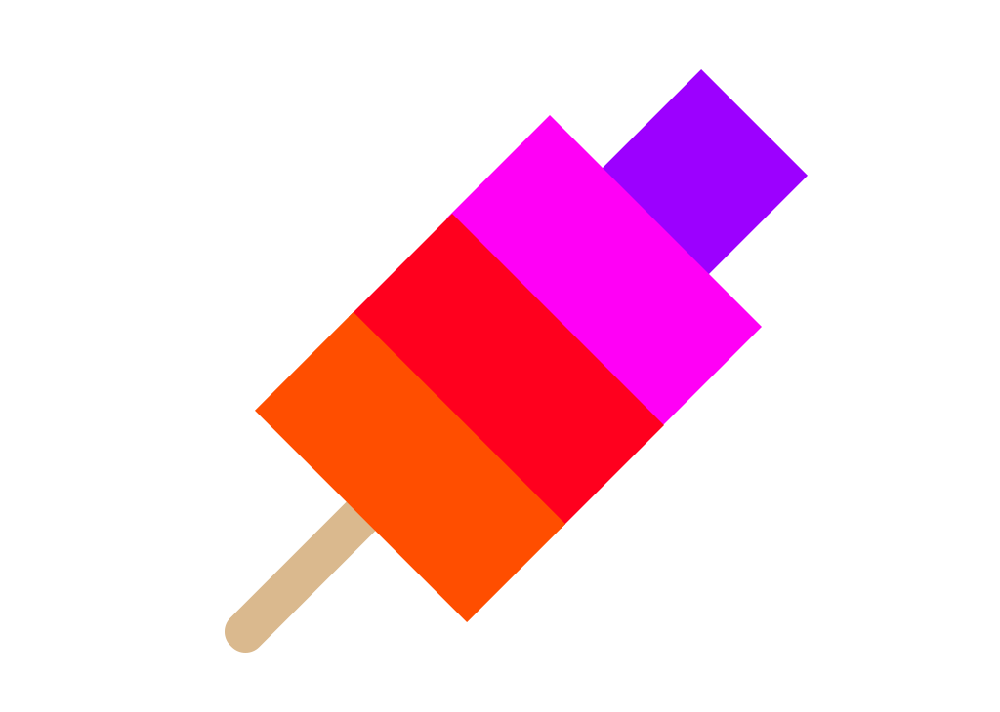

# Parsicle



A Swift parser combinator framework.  

Extracted from [InterfaCSS](http://www.github.com/tolo/InterfaCSS), originally inspired by [Parcoa](https://github.com/brotchie/Parcoa).

## Getting started

### Install

The simplest way is to use [CocoaPods](http://cocoapods.org/).

```
pod 'Parsicle'
```

*Support for Swift Package Manager is also on the way...*


## Examples

### Simple example with sequential parser

```Swift
let parsicle = Parsicles.sequential([
                                     .string("Hello"), 
                                     .spaces(1), 
                                     .string("World"), 
                                     .spaces(1),
                                     .choice([
                                              .char("🤯"),
                                              .char("😍"),
                                              .char("💩"), 
                                             ]), 
                                    ])
                                    
if parsicle.matches("Hello World 🤯") {
  print("🎉")
}
```


### Example using Swift [function builder syntax](https://github.com/apple/swift-evolution/blob/9992cf3c11c2d5e0ea20bee98657d93902d5b174/proposals/XXXX-function-builders.md)

```Swift
Sequential {
  "Hello"
  Spaces(1)
  "World"
  Spaces()
  Choice {
    "🤯"
    "😍"
    "💩"
  }
}
```

### More
See unit tests for more concrete examples: [ParsicleTests.swift](Tests/ParsicleTests/ParsicleTests.swift) 


## License

MIT license - see [here](LICENSE).
